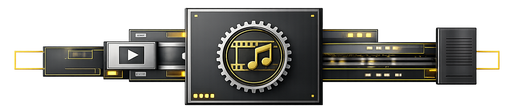

  

# Transcodr

Transcodr is a local‑first video transcoding platform for creators and small studios. It runs a reliable daemon with a REST API and a fast Web UI, so you can batch encode, automate with watchfolders, and keep full control of your media.

Current documented release: **v0.3.6**.

## Why Transcodr

- Own your pipeline and avoid expensive cloud workflows
- Process large libraries safely with repeatable profiles
- Use your hardware acceleration for faster encodes
- Automate ingestion with watchfolders and a clean API

## Key Features

- Web UI
- Daemon + REST API core (it powers the web UI and is directly accessible)
- Profile‑driven encoding (single or multi‑profile)
- Hardware acceleration: VAAPI (AMD/Intel), NVENC, QSV
- Watchfolders for automated ingest
- Safe replace or destination outputs
- SQLite‑backed queue that survives restarts
- Config editing via API and Web UI (Storage, Encoding, Daemon, Logging)
- Live configuration reload (`POST /api/reload`) from UI and API
- Multi‑daemon orchestration (planned, not yet implemented)

## What’s New Through v0.3.6

- Docker deployment support with helper script: `./docker/deploy.sh`
- Config directory override via `TRANSCODR_CONFIG_DIR` for Docker/self-hosted layouts
- Extension mismatch policy for replace mode (`rename`, `reject`, `keep`) with warning tracking
- Warning job status in history and API (`warning_message`, filter, clear-warning endpoint)

## Get Started

- Recommended for Docker: run the helper script from the repo root:
  - `./docker/deploy.sh` (rebuilds and restarts the stack)
  - `./docker/deploy.sh --no-cache` (rebuild without cache)

- Quick install: See **[prerequisites](docs/configuration.md#prerequisites)**
- Full install and configuration: See **[configuration](docs/configuration.md)**

## Documentation

- Configuration: how to install, initialize, and tune the daemon. See docs/configuration.md
- Profiles: define reusable encoding recipes and hardware variants. See docs/profiles.md
- Watchfolders: automate encoding from folders and command files. See docs/watchfolders.md
- Commands: YAML request format for jobs and watchfolders. See docs/commands.md
- API reference: endpoints for UI/CLI integrations. See docs/api-reference.md
- CLI reference: command‑line usage and helpers. See docs/cli-reference.md
- Architecture: system design and component overview. See docs/architecture.md
- Concurrency tuning: maximize throughput safely. See docs/concurrency-tuning.md
- Roadmap: planned features and direction. See docs/roadmap.md
- Changelog: version history and release notes. See docs/CHANGELOG.md

## License

See LICENSE.
